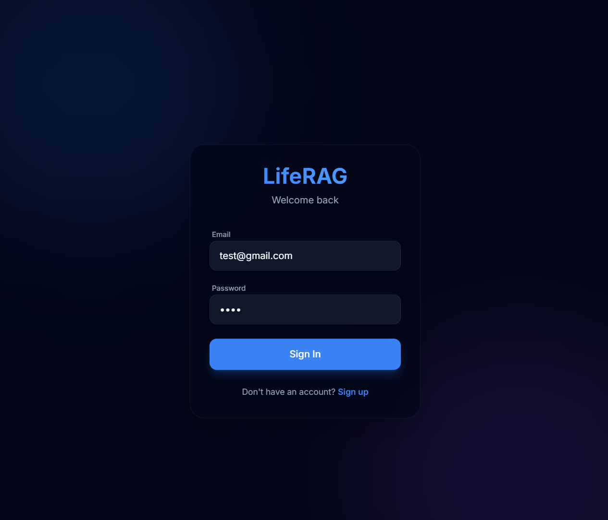
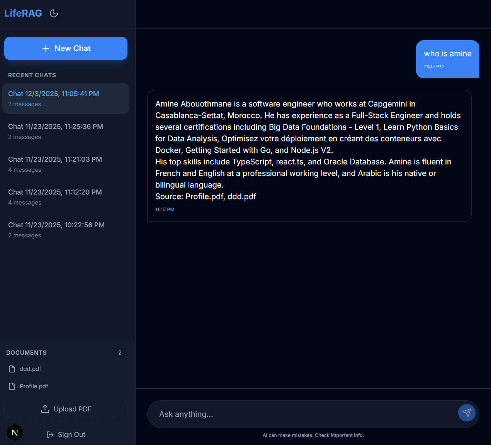
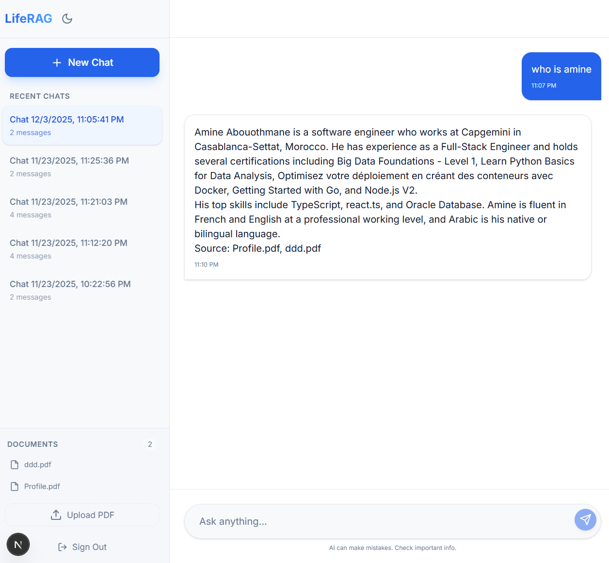
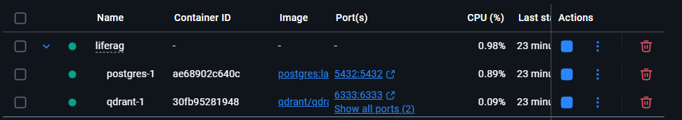
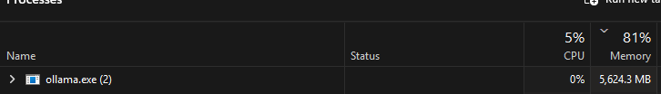

# 🧠 LifeRAG

**Your Second Brain** - A production-grade RAG system for chatting with your personal knowledge base.

[](https://dotnet.microsoft.com/)
[](https://python.org/)
[](https://nextjs.org/)
[](LICENSE)

## 🎯 What It Does

Upload your PDFs, documents, and notes. Chat with them using AI. Your data never leaves your machine.

**Built with enterprise-grade architecture:**
- 🔐 JWT Authentication
- 🚀 gRPC for blazing-fast communication
- 🧩 Semantic Kernel for AI orchestration
- 📦 Hangfire for background processing
- 🔍 Vector search with Qdrant
- 🤖 Local LLM via Ollama (or OpenAI)

## 🏗️ Architecture

```
┌─────────────────────────────────────────────────────────────┐
│                        Next.js UI                           │
│                    (localhost:3001)                         │
└────────────────────┬────────────────────────────────────────┘
                     │ HTTP/REST
                     ▼
┌─────────────────────────────────────────────────────────────┐
│                    .NET Web API                             │
│              Clean Architecture + Minimal API               │
│                    (localhost:5104)                         │
│  ┌──────────────┐  ┌──────────────┐  ┌──────────────┐     │
│  │   Hangfire   │  │ Semantic     │  │     JWT      │     │
│  │  Background  │  │   Kernel     │  │     Auth     │     │
│  │     Jobs     │  │ Orchestrator │  │              │     │
│  └──────────────┘  └──────────────┘  └──────────────┘     │
└────────────────────┬────────────────────────────────────────┘
                     │ gRPC (50051)
                     ▼
┌─────────────────────────────────────────────────────────────┐
│              Python RAG Microservice                        │
│                    (localhost:50051)                        │
│  ┌──────────────┐  ┌──────────────┐  ┌──────────────┐     │
│  │  LlamaIndex  │  │    Qdrant    │  │    Ollama    │     │
│  │   Chunking   │  │Vector Search │  │  Llama 3.1   │     │
│  └──────────────┘  └──────────────┘  └──────────────┘     │
└─────────────────────────────────────────────────────────────┘
                     │
                     ▼
┌─────────────────────────────────────────────────────────────┐
│                    Docker Services                          │
│  ┌──────────────┐              ┌──────────────┐            │
│  │  PostgreSQL  │              │    Qdrant    │            │
│  │    (5432)    │              │    (6333)    │            │
│  └──────────────┘              └──────────────┘            │
└─────────────────────────────────────────────────────────────┘
```

## ✨ Features

### 🔐 Authentication & Security
- JWT bearer token authentication
- Secure password hashing with BCrypt
- User isolation (your data is yours)

### 📄 Document Management
- Upload PDFs, DOCX, TXT files
- Automatic text extraction
- Background processing with Hangfire
- Store files as bytea in PostgreSQL

### 🤖 AI-Powered Chat
- Semantic Kernel orchestration
- Auto-invokes RAG retrieval when needed
- Maintains conversation context
- Supports OpenAI or local Ollama

### 🔍 RAG Pipeline
- **Embeddings**: nomic-embed-text-v1.5 (768-dim, open-source)
- **Vector Store**: Qdrant with HNSW indexing
- **Chunking**: Semantic splitting (512 tokens, 50 overlap)
- **LLM**: Llama-3.1-8B via Ollama

### 🚀 Performance
- gRPC for 10x faster communication vs REST
- Streaming responses
- Background job processing
- Efficient vector search

## 📸 Screenshots

### Authentication


### Home (Dark Mode)


### Home (Light Mode)


### Docker Containers


### Ollama RAM Consumption


## 🚀 Quick Start

### Prerequisites

- [.NET 9 SDK](https://dotnet.microsoft.com/download)
- [Python 3.11+](https://python.org/)
- [Node.js 18+](https://nodejs.org/)
- [Docker Desktop](https://docker.com/)
- [Ollama](https://ollama.ai/)

### 1. Clone & Setup Infrastructure

```bash
git clone <your-repo>
cd LifeRAG

# Start PostgreSQL + Qdrant
docker-compose up -d
```

### 2. Setup Python RAG Service

```bash
cd liferag-python

# Windows
.\install.ps1

# Linux/Mac
chmod +x install.sh
./install.sh

# Generate gRPC stubs
.\generate_protos.ps1  # or ./generate_protos.sh

.\venv\Scripts\Activate.ps1
# Start gRPC server
python grpc_server.py
```

### 3. Setup .NET API

```bash
cd LifeRAG.Api

# Restore & build
dotnet restore
dotnet build

# Run
dotnet run
```

API will be available at `http://localhost:5104`
- Swagger: `http://localhost:5104/swagger`
- Hangfire: `http://localhost:5104/hangfire`

### 4. Setup Frontend

```bash
cd frontend

# Install dependencies
npm install

# Copy environment file
cp .env.example .env.local

# Start dev server
npm run dev
```

Frontend will be available at `http://localhost:3001`

### 5. Setup Ollama

```bash
# Install Ollama from https://ollama.ai/

# Pull the embedding model
ollama pull nomic-embed-text-v1.5

# Pull the LLM model
ollama pull llama3.1:8b

# Start Ollama (usually runs automatically)
ollama serve
```

## 🎮 Usage

1. **Register/Login** at `http://localhost:3001`
2. **Upload Documents** - Click "Upload PDF" in the sidebar
3. **Create Chat Session** - Click "New Chat"
4. **Ask Questions** - Chat with your documents!

Example:
```
You: "What are the key points from my meeting notes?"
AI: "Based on your uploaded documents, the key points were..."
```

## 📁 Project Structure

```
LifeRAG/
├── LifeRAG.Api/              # .NET Web API (Minimal API)
│   ├── Endpoints/            # REST endpoints
│   ├── Program.cs            # App configuration
│   └── appsettings.json      # Configuration
├── LifeRAG.Core/             # Domain layer
│   ├── Entities/             # Database models
│   ├── DTOs/                 # Data transfer objects
│   ├── Interfaces/           # Service contracts
│   └── Protos/               # gRPC proto files
├── LifeRAG.Infrastructure/   # Infrastructure layer
│   ├── Data/                 # EF Core DbContext
│   ├── Services/             # Business logic
│   ├── Repositories/         # Data access
│   └── Plugins/              # Semantic Kernel plugins
├── liferag-python/           # Python RAG microservice
│   ├── main.py               # FastAPI server (legacy)
│   ├── grpc_server.py        # gRPC server
│   ├── rag_engine.py         # LlamaIndex + Qdrant
│   ├── document_processor.py # Text extraction
│   └── protos/               # gRPC proto files
├── frontend/                 # Next.js UI
│   ├── app/                  # App router pages
│   ├── lib/                  # API client
│   └── components/           # React components
└── docker-compose.yml        # PostgreSQL + Qdrant
```

## ⚙️ Configuration

### .NET API (`appsettings.json`)

```json
{
  "ConnectionStrings": {
    "DefaultConnection": "Host=localhost;Port=5432;Database=liferag;Username=user;Password=password"
  },
  "Jwt": {
    "Key": "your-secret-key-min-32-chars",
    "Issuer": "LifeRAG",
    "Audience": "LifeRAG"
  },
  "PythonRagService": {
    "GrpcUrl": "http://localhost:50051"
  },
  "SemanticKernel": {
    "UseOpenAI": false,
    "Ollama": {
      "Url": "http://localhost:11434",
      "Model": "llama3.1:8b"
    }
  }
}
```

### Python Service (`.env`)

```bash
QDRANT_HOST=localhost
QDRANT_PORT=6333
OLLAMA_BASE_URL=http://localhost:11434
EMBEDDING_MODEL=nomic-embed-text-v1.5
LLM_MODEL=llama3.1:8b
COLLECTION_NAME=liferag_documents
CHUNK_SIZE=512
CHUNK_OVERLAP=50
```

## 🔧 Tech Stack

### Backend (.NET)
- **Framework**: .NET 9 Minimal API
- **Architecture**: Clean Architecture (Core, Infrastructure, API)
- **Database**: PostgreSQL + EF Core
- **Auth**: JWT Bearer
- **Background Jobs**: Hangfire
- **AI**: Semantic Kernel
- **Communication**: gRPC

### RAG Service (Python)
- **Framework**: gRPC Server
- **Embeddings**: nomic-embed-text-v1.5 (HuggingFace)
- **Vector DB**: Qdrant
- **RAG Framework**: LlamaIndex
- **LLM**: Ollama (Llama 3.1)

### Frontend
- **Framework**: Next.js 15 (App Router)
- **Styling**: TailwindCSS
- **Language**: TypeScript

## 🎯 Key Design Decisions

### Why gRPC?
- **10x faster** than REST for large file transfers
- **Streaming** support for real-time responses
- **Type-safe** with Protocol Buffers
- **Efficient** binary serialization

### Why Semantic Kernel?
- **Auto function calling** - SK decides when to retrieve context
- **Orchestration** - Manages complex AI workflows
- **Flexibility** - Swap LLMs with config change
- **Production-ready** - Built by Microsoft

### Why Hangfire?
- **Async processing** - No timeouts on large files
- **Resilience** - Automatic retries
- **Monitoring** - Built-in dashboard
- **Scalability** - Process multiple files concurrently

### Why Clean Architecture?
- **Testability** - Easy to unit test
- **Maintainability** - Clear separation of concerns
- **Flexibility** - Swap implementations easily
- **Scalability** - Add features without breaking existing code

## 📊 API Endpoints

### Authentication
- `POST /api/auth/register` - Create account
- `POST /api/auth/login` - Get JWT token

### Documents
- `POST /api/documents/upload` - Upload file (returns 202 Accepted)
- `GET /api/documents` - List user documents
- `GET /api/documents/{id}` - Download document
- `DELETE /api/documents/{id}` - Delete document

### Chat
- `POST /api/chat/sessions` - Create chat session
- `GET /api/chat/sessions` - List sessions
- `GET /api/chat/sessions/{id}` - Get session with messages
- `POST /api/chat/sessions/{id}/messages` - Send message
- `DELETE /api/chat/sessions/{id}` - Delete session

## 🔮 Future Enhancements

- [ ] Multi-modal support (images, audio)
- [ ] WhatsApp/Notion/Google Drive integrations
- [ ] Advanced RAG techniques (HyDE, ReRank)
- [ ] Multi-user workspaces
- [ ] Mobile app
- [ ] Voice chat
- [ ] Export conversations


## 📄 License

MIT License - see [LICENSE](LICENSE) file for details.

## 🙏 Acknowledgments

- [LlamaIndex](https://llamaindex.ai/) - RAG framework
- [Semantic Kernel](https://github.com/microsoft/semantic-kernel) - AI orchestration
- [Qdrant](https://qdrant.tech/) - Vector database
- [Ollama](https://ollama.ai/) - Local LLM runtime
- [Hangfire](https://hangfire.io/) - Background jobs

---

**Built with ❤️ for privacy-conscious knowledge workers**

*Your data, your machine, your control.*
